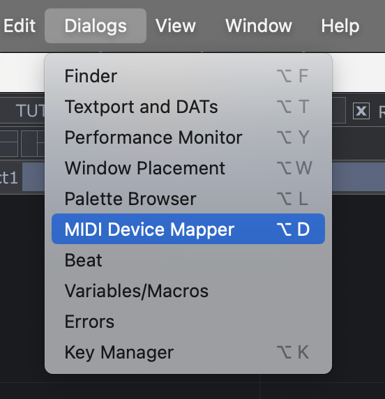
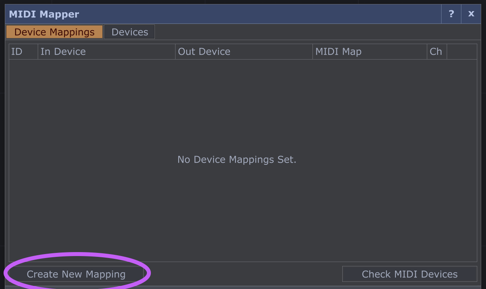
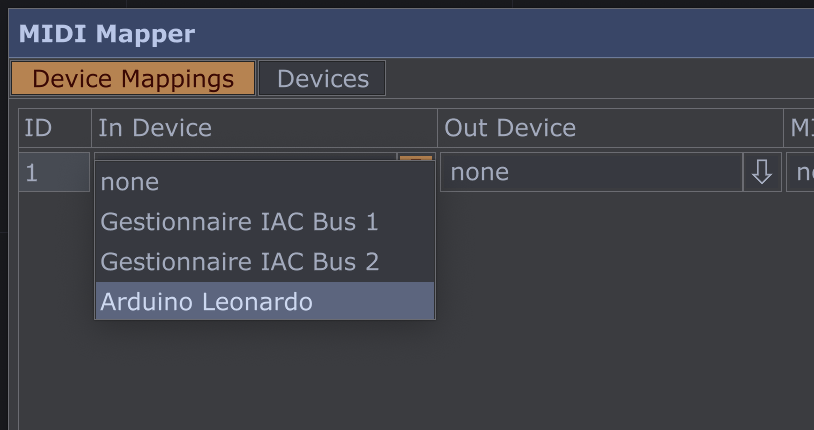
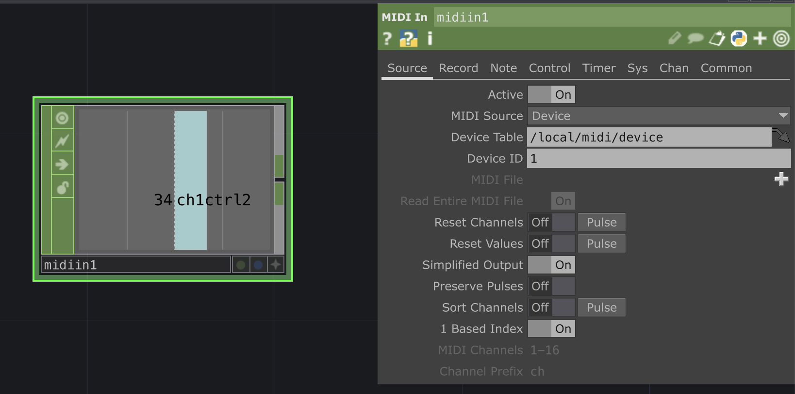

# How to send MIDI from Arduino

*Or how to communicate via MIDI using an Arduino board as a MIDI controller.*

French version [here](https://github.com/LucieMrc/Arduino_MIDI_USB_FR)

- Valentin's [Introduction to Arduino](https://www.valentindupas.com/courses/arduino/1-_Arduino_from_the_ground_up) 
- B2renger's [introduction to Arduino and sensors](https://github.com/b2renger/Introduction_Arduino/tree/english)

## MIDI communication

MIDI (Musical Instrument Digital Interface) is a communications protocol for music, most commonly used for communication between electronic instruments, controllers and music software.

Midi data is communicated on 16 channels, with a range of 0 to 127. There are therefore 128 notes per channel, and 128 control changes.

## Send MIDI with Arduino

*MIDI Arduino library [functions list](https://arduinomidilib.sourceforge.net/a00001.html).*

To allow MIDI communication via USB, we need a usb-midi library for Arduino. Here, I use [USB-MIDI](https://github.com/lathoub/Arduino-USBMIDI).

To create a midi instance, we use the function
`USBMIDI_CREATE_DEFAULT_INSTANCE();`

In the setup(), we use `MIDI.begin(4)` to start the midi communication and listen to the channel 4.

### Send and stop a note

We can use the function `MIDI.sendNoteOn(a, b, c);` to send a note, where **a** is the note (from 0 to 127), **b** is the velocity ( = the force with which a note is played, from 0 to 127) and **c** is the channel (from 0 to 16).

To stop the note, we use the function `MIDI.sendNoteOff(a, b, c);` in the same way.

In the library example code "Basic_IO" :
```
        MIDI.sendNoteOn(42, 127, 1);
        delay(1000);
        MIDI.sendNoteOff(42, 0, 1); 
        delay(1000);
```

We send the note 42, with a velocity of 127, on the channel 1, and we stop it 1 second later.

*[Informations](https://www.phys.unsw.edu.au/jw/notes.html) on midi notes and their equivalent in american notation and frequencies on the UNSW website.*

### Send a Control Change

We use the function `MIDI.sendControlChange(a, b, c);` where **a** is the control number (from 0 to 127), **b** is the value (from 0 to 127) and **c** is the channel (from 0 to 16).

<!-- ### Boutons et potentiomètres

### MPR121 // détails

On peut utiliser un MPR121 afin de créer ses propres capteurs capacitifs, -->

## Receive MIDI in TouchDesigner

To receive midi in TouchDesigner from a midi controller, we need to create the controller input.



Open Dialogs > MIDI Device Mapper.



Create the input with `Create New Mapping`.



Select the Arduino board in the "In Device" column.



By creating a `Midi In` CHOP in the network, we get incoming midi messages.

# To go further

- interfaces souples
- arduino DMX ??
# Arduino_MIDI_USB_EN
