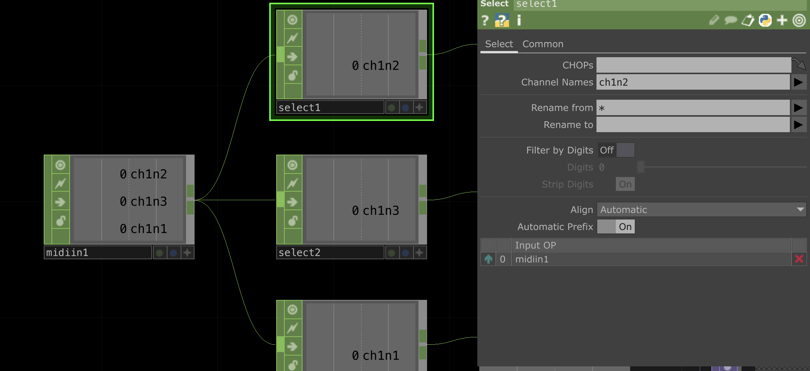
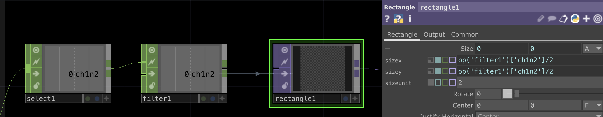
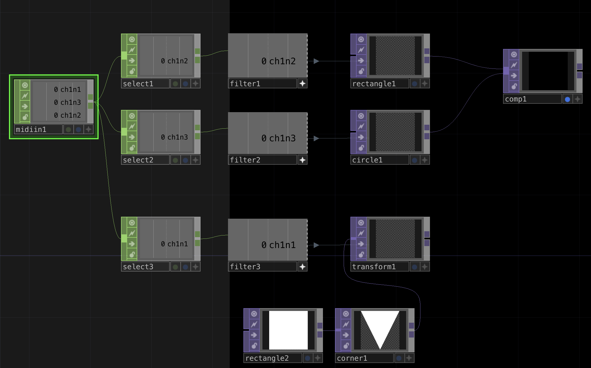

# How to send MIDI from Arduino

*Or how to communicate via MIDI using an Arduino board as a MIDI controller.*

French version [here](https://github.com/LucieMrc/Arduino_MIDI_USB_FR)

- Valentin's [Introduction to Arduino](https://www.valentindupas.com/courses/arduino/1-_Arduino_from_the_ground_up) 
- B2renger's [introduction to Arduino and sensors](https://github.com/b2renger/Introduction_Arduino/tree/english)

https://github.com/user-attachments/assets/c2010b42-fa77-4d7c-9026-c64da561116d

*Interactive shapes in TouchDesigner appearing when a touch is detected on each felted shapes connected to an Arduino Leonardo*

## MIDI communication

MIDI (Musical Instrument Digital Interface) is a communications protocol for music, most commonly used for communication between electronic instruments, controllers and music software.

Midi data is communicated on 16 channels, with a range of 0 to 127. There are therefore 128 notes per channel, and 128 control changes.

## Send MIDI with Arduino

All Arduino boards can not be detected as midi controller by computers through USB. This tutorial works with a **Leonardo**, but did not work with an Uno or a Due for example.

To allow MIDI communication via USB, we need a usb-midi library for Arduino. Here, I use [USB-MIDI](https://github.com/lathoub/Arduino-USBMIDI).

To create a midi instance, we use the function
`USBMIDI_CREATE_DEFAULT_INSTANCE();`

In the setup(), we use `MIDI.begin(4)` to start the midi communication and listen to the channel 4.

*MIDI Arduino library [functions list](https://arduinomidilib.sourceforge.net/a00001.html).*

### Send and stop a note

We can use the function `MIDI.sendNoteOn(a, b, c);` to send a note, where **a** is the note (from 0 to 127), **b** is the velocity ( = the force with which a note is played, from 0 to 127) and **c** is the channel (from 0 to 16).

To stop the note, we use the function `MIDI.sendNoteOff(a, b, c);` in the same way.

In a version of the library example code "Basic_IO" :
```
#include <USB-MIDI.h>

USBMIDI_CREATE_DEFAULT_INSTANCE();

void setup() {
    MIDI.begin(4);
}

void loop() {
    MIDI.sendNoteOn(42, 127, 1);
    delay(1000);
    MIDI.sendNoteOff(42, 0, 1); 
    delay(1000);
}
```

We send the note 42, with a velocity of 127, on the channel 1, and we stop it 1 second later.

*[Informations](https://www.phys.unsw.edu.au/jw/notes.html) on midi notes and their equivalent in american notation and frequencies on the UNSW website.*

### Send a Control Change

We use the function `MIDI.sendControlChange(a, b, c);` where **a** is the control number (from 0 to 127), **b** is the value (from 0 to 127) and **c** is the channel (from 0 to 16).

<!-- ### Boutons et potentiomètres

### MPR121 // détails

On peut utiliser un MPR121 afin de créer ses propres capteurs capacitifs, -->

## Receive MIDI in TouchDesigner

To receive midi in TouchDesigner from a midi controller, we need to create the controller input.


Open Dialogs > MIDI Device Mapper.


Create the input with `Create New Mapping`.


Select the Arduino board in the "In Device" column.


By creating a `Midi In` CHOP in the network, we get incoming midi messages.

## Example project : the shapes

### In Arduino

To make shapes appears in TouchDesigner by touching conductives objects like in the video at the top of the page, we use a MPR121.

A MPR121 is a capacitive sensor and detects if one of its twelve pins (or conductive objects connected to the pins) is being touched. Here, I use conductive yarn fibers that I felted into geometric shapes, connected to the pins with cables sticked into the shapes.

*[Link](https://learn.adafruit.com/adafruit-mpr121-12-key-capacitive-touch-sensor-breakout-tutorial) of the Adafruit document of the MPR121, with the wiring explaination.*

To use the MPR121, we need to add the library Adafruit_MPR121 to the library manager.

In the Arduino code, we want to detect each time a pin is touched (when it was not touched before) to send a midi note with the note value being the pin number.
When we stop touching the pin, the note stops.

The code of the file "MIDI_MPR121" :

```
#include <USB-MIDI.h>
#include <Wire.h>
#include "Adafruit_MPR121.h"

#ifndef _BV
#define _BV(bit) (1 << (bit))
#endif

Adafruit_MPR121 cap = Adafruit_MPR121();

uint16_t lasttouched = 0;
uint16_t currtouched = 0;

USBMIDI_CREATE_DEFAULT_INSTANCE();

void setup() {
  Serial.begin(9600);
  while (!Serial) {
    delay(10);
  }
  Serial.println("Adafruit MPR121 Capacitive Touch sensor test");
  if (!cap.begin(0x5A)) {
    Serial.println("MPR121 not found, check wiring?");
    while (1)
      ;
  }
  Serial.println("MPR121 found!");
  MIDI.begin(4);
}

void loop() {
  currtouched = cap.touched();    //check the pins states
  for (uint8_t i = 0; i < 12; i++) {    // for each twelve pins
    if ((currtouched & _BV(i)) && !(lasttouched & _BV(i))) {        // if the pin was untouched and is now being touched
      Serial.print(i);
      Serial.println(" touched");
      MIDI.sendNoteOn(i, 127, 1);   // sends which pin is touched as a midi note
    }
    if (!(currtouched & _BV(i)) && (lasttouched & _BV(i))) {        // if it was touched and it is now not touched
      Serial.print(i);
      Serial.println(" released");
      MIDI.sendNoteOff(i, 0, 1);    // stops the note
    }
  }
  lasttouched = currtouched;    //each pin state is now the previous state
}
```
### In Touchdesigner

In TouchDesigner, we create a `Midi In` CHOP to get the incoming midi notes. We see appearing the notes for each pin as we touch them.
The notes are named "ch1n**i**" where ch1 means midi channel 1 and n**i** is the number of the pin that we use as a note.



By adding a `Select` CHOP for each note, we can isolate the value to have 0 or 1 for each note dependings on whether it is being played or not ( = if the pin is being touched or not).



We then add a `Filter` CHOP to have a transition between the 0 and 1 and soften the animation.

Finally, we create a `Rectangle` TOP and we give it the value of the Filter divided by 2 as Size.
This way, when the pin is not being touched the rectangle is not visible as its size is 0 by 0, and when the pin is touched, it grows to 0.5 by 0.5.



The file "MIDI_reception.toe"

# To go further

- interfaces souples
- arduino DMX ??
